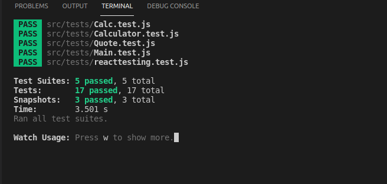

# React Calculator

A calculator app built with React.js using React Hooks and Routers. App contains 3 pages with basic styling. Calculator operations, as well as React components, were tested with Jest and React Testing Library

## Calculator screenshot

## Built With

- [React.js](https://reactjs.org/)
- [JavaScript](https://www.javascript.com/)
- [Webpack](https://webpack.js.org/)
- [HTML](https://html.spec.whatwg.org/)/[CSS](https://www.w3.org/TR/CSS/#css)
- [Jest (JavaScript Testing Framework)](https://jestjs.io/)
- [Snapshot Testing](https://reactjs.org/docs/testing-recipes.html)

## Getting Started

To set up a local copy of the project

- `git clone git@github.com:akshay-narkar/Calculator-React.git`
- `cd Calculator-React`
- `git branch testing`

If you want to repack the file

- Run `npm install` on the terminal to install dependancies
- Run `npm run build` to bundle the files in the src folder & product ouput in dist folder
- Run `npm run start` to check live server

## Testing

Calculator operations has been tested in various scenarious with Jest Testing Framework.
Main React components have been tested with Snapshot testing.

- Run `npm run test` to run the tests

## Live Link of the project

[Live-Calculator](https://calculator-react-microakshay.herokuapp.com/)

## Author

👤 **Akshay Narkar**

- Github: [@akshay-narkar](https://github.com/akshay-narkar)
- Twitter: [Akshay](https://www.twitter.com/akidoit)
- Linkedin: [Akshay Narkar](https://www.linkedin.com/in/akshaynarkar25/)

## 🤝 Contributing

Contributions, issues, and feature requests are welcome!

## Show your support

Give a ⭐️ if you like this project!

## Acknowledgments

- Thanks to Odin project for the tutorials.

## 📝 License

This project is [MIT](LICENSE) licensed.
